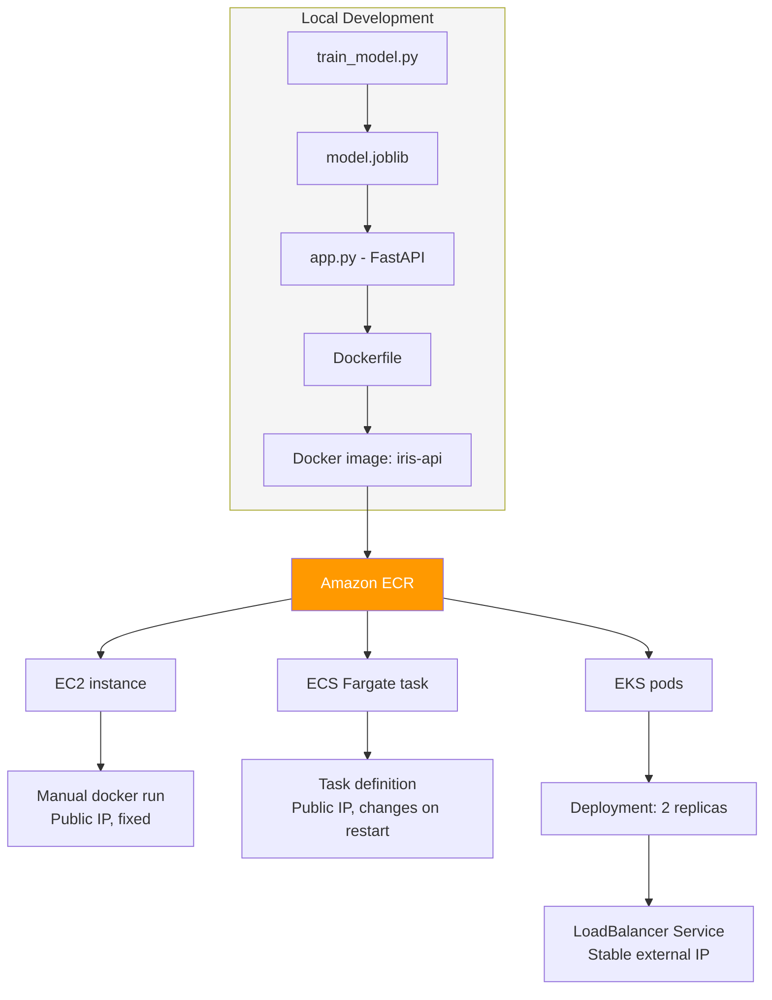

# Deploying a Containerized ML Model Three Ways: EC2, ECS Fargate, and EKS

A small project built to deeply understand the tradeoffs between AWS's three main
container deployment paths, by actually running the same image on all three rather
than reading about the differences.

## What this is

A trained scikit-learn model (a random forest classifier on the iris dataset)
wrapped in a FastAPI service, containerized with Docker, and deployed three
separate ways on AWS:

1. **EC2**, by hand: provision a server, install Docker, run the container manually
2. **ECS Fargate**, managed containers: describe the desired state, AWS runs it
3. **EKS**, Kubernetes: the same desired state model, with multiple replicas and
   a real load balancer in front of them

The model itself is intentionally trivial. The point of this project is the
infrastructure, not the data science.

## Architecture



## Why each stage made the choices it did

### EC2, done manually first, on purpose

EC2 was deliberately the first and most manual stage. No managed scheduling, no
automatic recovery, just a virtual machine with Docker installed on it by hand,
and a single `docker run` command.

Key decisions:

- **IAM role attached to the instance, not copied access keys.** The instance
  needs permission to pull from ECR. Rather than running `aws configure` on the
  instance with static credentials, an IAM role (`EC2-ECR-ReadOnly-Role`) was
  attached directly to it. The instance gets temporary, automatically rotated
  credentials, and the permissions are scoped to read only, since this instance
  never needs to push or delete images.
- **Security groups restricted to "My IP."** SSH (port 22) and the app port
  (8000) were both locked to the operator's own IP address rather than opened
  to the entire internet, since this was a personal learning instance, not a
  public service.
- **Architecture mismatch, caught and fixed here first.** The image was
  originally built on Apple Silicon (arm64), but EC2's `t2.micro` runs on amd64.
  This surfaced as `no matching manifest for linux/amd64` on `docker pull`, and
  was fixed by rebuilding with
  `docker buildx build --platform linux/amd64`. This fix carried forward into
  both later stages automatically, since the same corrected image in ECR was
  reused for ECS and EKS.

**What this stage made visible:** everything that ECS and EKS later hide. OS
patching, Docker installation, manual container restarts, and no automatic
recovery if the container or instance ever crashed.

### ECS Fargate, the first managed step

ECS removed the server entirely. Fargate runs containers without exposing any
underlying EC2 instance to manage.

Key decisions:

- **A task execution role, separate from the EC2 role.** ECS tasks need their
  own identity to pull images from ECR and write logs to CloudWatch, scoped
  only to that, not inherited from any human's AWS permissions. This is the
  same least privilege principle as the EC2 role, applied again in a different
  context.
- **A task definition file instead of a run command.** Rather than an
  imperative `docker run` command, the task is described declaratively: this
  image, this much CPU and memory, this port, this logging configuration. AWS
  decides how to actually run and maintain that description, including
  restarting it automatically if it fails.
- **CloudWatch Logs, set up before anything ran.** Fargate has no server to SSH
  into, so there was no way to debug the running container by hand the way EC2
  allowed. Logging had to be configured upfront, not added after something went
  wrong.

**The gap this stage exposed, deliberately left unfixed:** each time the task
restarted (manually stopped, crashed, or redeployed), it received a new public
IP. There was no load balancer in front of it, so this instability was fully
visible rather than papered over.

### EKS, the full Kubernetes model

EKS introduced Kubernetes concepts directly: pods, deployments, and services,
on top of a real managed cluster with its own worker nodes.

Key decisions:

- **A Deployment with 2 replicas, not 1.** Unlike the single ECS task, this
  stage ran two copies of the pod simultaneously, so the failure of one does
  not interrupt service while Kubernetes replaces it.
- **A Service of type LoadBalancer, directly solving the ECS IP problem.**
  This provisions a real AWS load balancer in front of the pods. Clients hit
  one stable external address; Kubernetes handles routing traffic to whichever
  replicas are currently healthy, regardless of how many times individual pods
  are replaced underneath.
- **`kubectl apply`, not `create` or `run`.** Consistent with the declarative
  model from ECS, re-running `apply` after changing the YAML file only updates
  what actually changed, rather than requiring a full teardown and recreation.

**What this stage cost that the others did not:** real operational complexity.
A VPC, a control plane, and actual EC2 worker nodes all had to be provisioned
and paid for continuously, roughly $0.10 per hour for the control plane alone,
even when fully idle. This was deleted the same day testing finished.

## The IP changing problem, specifically

Worth calling out on its own, since it is the clearest illustration of why
load balancers exist.

On EC2, the public IP was stable because there was exactly one long lived
server. On ECS Fargate, every task restart (a manual stop, a crash, a new
image deployment) produced a brand new IP address, since Fargate tasks are
ephemeral by design. This is unacceptable for any real client depending on a
stable endpoint.

EKS's `LoadBalancer` Service type solves this directly: the load balancer's
address is what stays constant, not any individual pod's address.
Kubernetes continuously tracks which pods are healthy and routes incoming
traffic only to those, transparently to whoever is calling the API. This same
fix, a load balancer in front of ephemeral compute, is the standard answer
to this problem in ECS too, it was simply left unimplemented there
intentionally, to make the gap visible before the fix was introduced in EKS.

## Side by side comparison

| | EC2 | ECS Fargate | EKS |
|---|---|---|---|
| Who manages the server | You, by hand | AWS, fully hidden | AWS control plane; worker nodes still real EC2 instances |
| Recovery from crash | None, manual restart required | Automatic, enforced by desired count | Automatic, enforced by replica count |
| Stable network address | Yes, by default (single instance) | No, changes on every task restart | Yes, via LoadBalancer Service |
| Setup described as | Imperative commands | Declarative task definition | Declarative Kubernetes manifests |
| Debugging | SSH directly into the box | CloudWatch Logs only | CloudWatch Logs plus `kubectl logs` |
| Idle cost | Instance hours only | Pay only while tasks run | Control plane cost continues even when idle |
| Best suited for | Full control, specific instance needs, legacy workloads | Most containerized workloads on AWS | Teams already standardized on Kubernetes, complex orchestration needs |

## What I would do differently with more time

- Add a load balancer to the ECS stage as well, to compare its setup directly
  against the EKS LoadBalancer Service rather than leaving ECS unresolved.
- Replace the console driven networking steps (VPC, subnets, security groups)
  with Terraform, so the entire environment could be recreated or destroyed
  with one command instead of manual steps across three different consoles.
- Add a CI/CD pipeline (GitHub Actions) to automatically rebuild and push the
  image to ECR on every commit, removing the manual `docker build` and
  `docker push` steps from the workflow entirely.

## Repository structure

```
iris-container-project/
├── train_model.py        # trains and saves the model
├── app.py                 # FastAPI service that serves it
├── requirements.txt        # pinned dependencies
├── Dockerfile              # builds the image, trains the model at build time
├── .dockerignore
├── .gitignore
├── task-definition.json    # ECS Fargate task definition
├── deployment.yaml         # EKS Deployment and Service manifests
└── README.md                # this file
```
